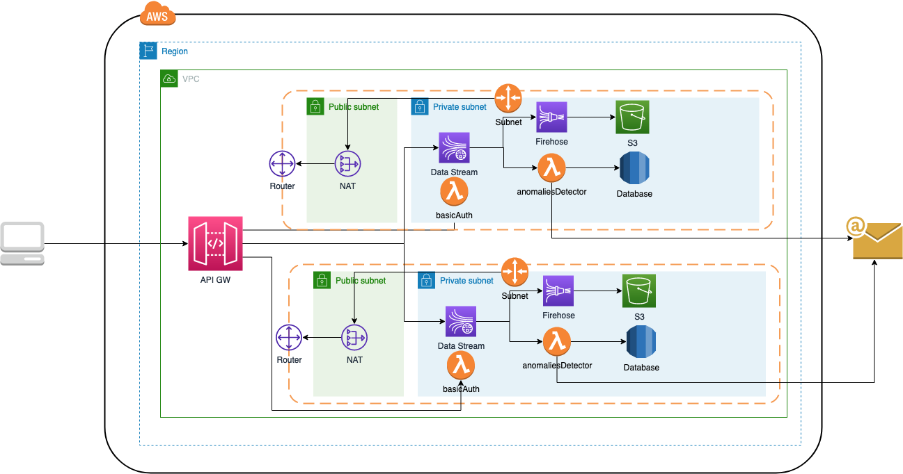

# real_time_streaming_analytics

In this repository, we look at how we can use managed services such as Amazon Kinesis to handle our incoming data analytics streams from our sources while AWS handles the undifferentiated heavy lifting of managing the infrastructure.
Our purpose is to create a real time streaming service, where we produce payment transactions, which are pushed to AWS Kinesis data stream, are stored into AWS S3 for cold storage via AWS Kinesis Firehose, and a AWS Lambda detects anomalies in payment transactions (in payment amount > 1000) stores these anomalies to a database and notifies user via email.

## Architecture Flow
The flow pipeline for our microservice ecosystem is the 

## Deploy services

In order to deploy microservices in AWS run the following cmd:

```shell
deploy.sh
```

## Destroy services

In order to destroy clusters from AWS run the following cmd:

```shell
destroy.sh
```

## Endpoints

You can take a look at API's endpoints navigated to ${api_gateway_url} output from `deploy.sh` cmd.

### Collect transactions ###

```shell
POST ${api_gateway_url}/collector/transactions
```

Headers:
```json
{
    "x-api-key": "${api_gateway_api_key}"
}
```

Body Params:
```json
{
    "records": [
        {

                "trxId": "004ed073-91b4-4623-ae33-7bef7cd104b0",
                "amount": 9000,
                "senderId": "2f9c0f77-623d-4c1f-af82-1148ee062c03",
                "receiverId": "340515af-476d-446b-bbdd-ad2b8585afd4",
                "senderIban": "GRxxxxxxxxxxxxxxx",
                "receiverIban": "BYxxxxxxxxxxxxxxxx",
                "senderBankId": "EUROBANK",
                "receiverBankId": "ALPHA",
                "transactionDate": "2022-06-30T07:41:46+0000"

        },
        {

                "trxId": "280eaebf-165e-42e0-9212-22df1127e84c",
                "amount": 333,
                "senderId": "2f9c0f77-623d-4c1f-af82-1148ee062c03",
                "receiverId": "340515af-476d-446b-bbdd-ad2b8585afd4",
                "senderIban": "GRxxxxxxxxxxxxxxx",
                "receiverIban": "BYxxxxxxxxxxxxxxxx",
                "senderBankId": "EUROBANK",
                "receiverBankId": "ALPHA",
                "transactionDate": "2022-06-30T07:41:46+0000"
            
        },
        {

                "trxId": "19754ab1-b19d-470b-be0e-4e1bf511761a",
                "amount": 300,
                "senderId": "2f9c0f77-623d-4c1f-af82-1148ee062c03",
                "receiverId": "340515af-476d-446b-bbdd-ad2b8585afd4",
                "senderIban": "GRxxxxxxxxxxxxxxx",
                "receiverIban": "BYxxxxxxxxxxxxxxxx",
                "senderBankId": "EUROBANK",
                "receiverBankId": "ALPHA",
                "transactionDate": "2022-06-30T07:41:46+0000"
        }
    ]
}
```

Description: adds new transactions records in Kinesis streams to be used and analyzed for anomaly_transactions_detector lambda

## Show your support

Give a ⭐️ if this project helped you!
